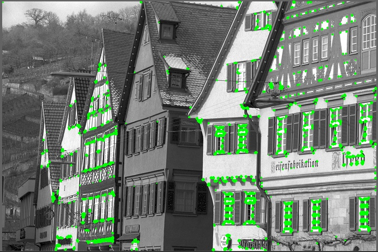

# Harris Corner Detection

(readme.md is generated by copilot)

## Project Description

This project implements the Harris Corner Detection algorithm for computer vision. The Harris corner detector is a mathematical operator that identifies corner features in images by analyzing the local changes in intensity when moving a small window in different directions.

This implementation was developed as Lab 02 for Computer Vision course to demonstrate understanding of feature detection techniques in image processing.

## Features

- Grayscale image conversion
- Gradient computation using Sobel operators
- Covariance matrix calculation
- Harris response computation
- Non-maximum suppression
- Visual output with highlighted corner points

## Installation

1. Download the executable file `21120127.exe` from Release section.
2. Or you can manually build the project using Visual Studio 2019 or later.

## Requirements

- Windows operating system
- No additional libraries required for running the executable

## Usage

1. Place your input images in the `Data/input` directory
2. Open command prompt and navigate to the executable directory
3. Run the program using the following syntax:

```
21120127.exe -harris <input_image_name> <output_image_name>
```

4. The processed image with detected corners will be saved in the `Data/output` directory

## Example

```
21120127.exe -harris house.jpg house_corners.jpg
```

This command will:
1. Read `house.jpg` from the `Data/input` directory
2. Apply the Harris corner detection algorithm
3. Save the result as `house_corners.jpg` in the `Data/output` directory

Result example:


## Algorithm Overview

The Harris corner detector works by:
1. Converting color images to grayscale
2. Computing image gradients using Sobel operators
3. Calculating the covariance matrix for each pixel
4. Computing the Harris response score using determinant and trace
5. Applying threshold and non-maximum suppression to identify corners

## Results

The algorithm successfully detects corners in various images, performing especially well on images with clear geometric structures and high contrast.